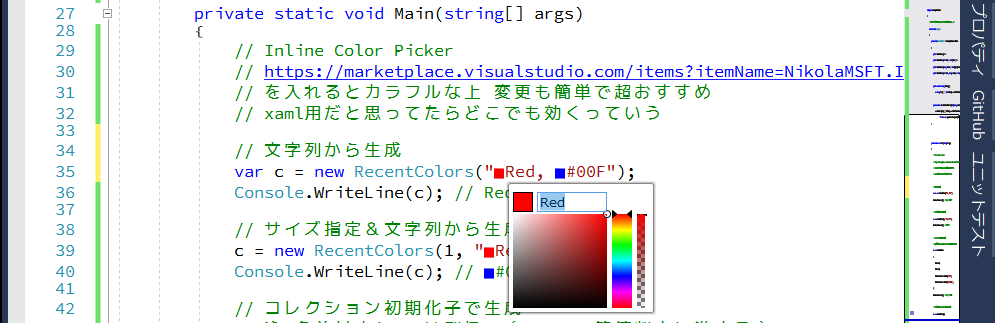

# HistoryCollection<T\>

## 概要
重複せずに指定個数以上は古いものから忘れていくコレクション

最近使ったファイル等の履歴管理にどうぞ

プロジェクトコードでは無駄に凝った```System.Drawing.Color```での使用例となっております

## 使用例
```C#
var i = new HistoryCollection<int> { 1, 1, 2, };
Console.WriteLine(i); // {1, 2}
i.Add(3);
Console.WriteLine(i); // {1, 2, 3}
i.Limit = 2;
Console.WriteLine(i); // {2, 3}
i.Add(2);
Console.WriteLine(i); // {3, 2}
```
## Tips
[Inline Color Picker](https://marketplace.visualstudio.com/items?itemName=NikolaMSFT.InlineColorPicker) おすすめです



## ライセンス
CC0 1.0 Universal

[](LICENSE)